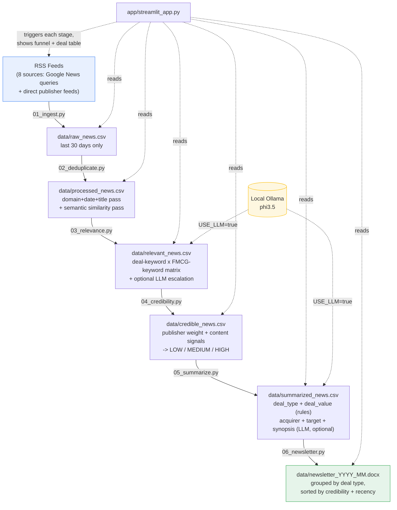

```mermaid
flowchart TD
    A["RSS Feeds<br/>(8 sources: Google News queries<br/>+ direct publisher feeds)"] -->|"01_ingest.py"| B["data/raw_news.csv<br/>last 30 days only"]

    B -->|"02_deduplicate.py"| C["data/processed_news.csv<br/>domain+date+title pass<br/>+ semantic similarity pass"]

    C -->|"03_relevance.py"| D["data/relevant_news.csv<br/>deal-keyword x FMCG-keyword matrix<br/>+ optional LLM escalation"]

    D -->|"04_credibility.py"| E["data/credible_news.csv<br/>publisher weight + content signals<br/>-> LOW / MEDIUM / HIGH"]

    E -->|"05_summarize.py"| F["data/summarized_news.csv<br/>deal_type + deal_value (rules)<br/>acquirer + target + synopsis (LLM, optional)"]

    F -->|"06_newsletter.py"| G["data/newsletter_YYYY_MM.docx<br/>grouped by deal type,<br/>sorted by credibility + recency"]

    H["app/streamlit_app.py"] -.->|"triggers each stage,<br/>shows funnel + deal table"| A
    H -.->|"reads"| B
    H -.->|"reads"| C
    H -.->|"reads"| D
    H -.->|"reads"| E
    H -.->|"reads"| F
    H -.->|"reads"| G

    I[("Local Ollama<br/>phi3.5")] -.->|"USE_LLM=true"| D
    I -.->|"USE_LLM=true"| F

    style A fill:#e8f0fe,stroke:#4285f4
    style G fill:#e6f4ea,stroke:#34a853
    style I fill:#fef7e0,stroke:#fbbc04
```
